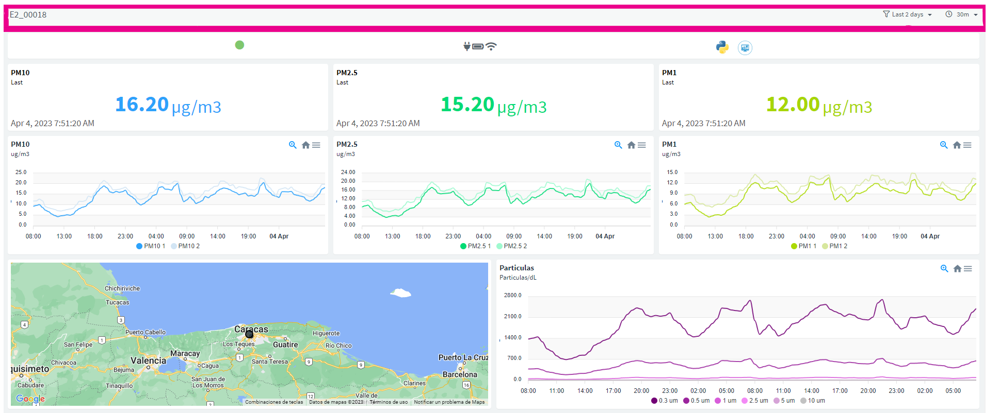
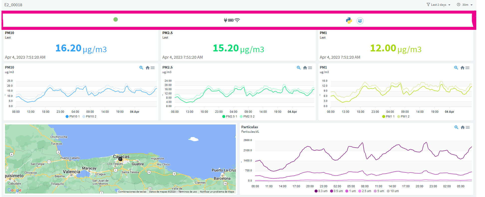
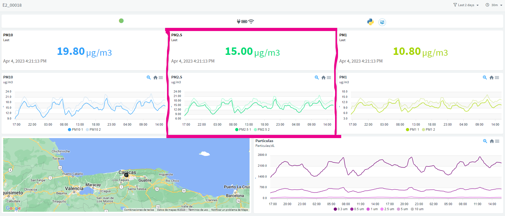
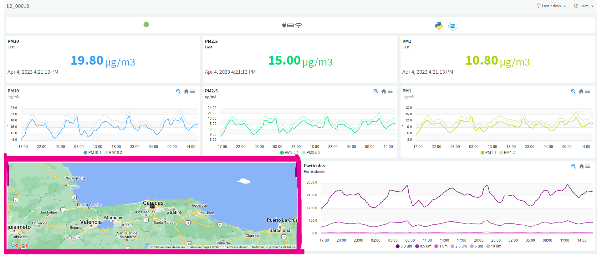

# 📈 Dashboards

Los dashboards de datos, sirven para visualizar y compartir los datos de tus dispositivos con cualquier persona, estos dashboards son aplicaciones WEB pero pueden también ser un icono en tu celular para que los encuentres fácilmente, en la sección de [#acceso-rapido-a-dashboards](dashboards.md#acceso-rapido-a-dashboards "mention")encontraras mas detalles sobre esto.

## Herramientas



<figure><figcaption>
Control
</figcaption></figure>

En la parte **izquierda** del recuadro se puede observar el **ID** del dispositivo que ha generado los datos que se visualizan, mientras que en la **derecha** se tiene **dos herramientas**, una para **controlar** las **fechas** en que se desea **visualizar** los datos y la otra el periodo de tiempo en que se quiere **promediar** los **datos**, esto ultimo suavizara los gráficos.



<figure><figcaption>
Estado
</figcaption></figure>

Para este componente se tienen 3 columnas, cada una representa:

1. Conectividad
   1. :green\_circle: Conectado
   2. :white\_circle: Desconectado
2. Logs
   1. Energizado
   2. Batería
   3. Wifi
3. Documentación
   1. Redirige a la API/SDK
   2. Redirige a esta documentación



<figure><figcaption>
Medición
</figcaption></figure>


**INFO**: En cada medición, se muestra un número junto a una curva más oscura. Este número corresponde al sensor principal que se ha utilizado para realizar esa medición y la curva más oscura representa los datos recopilados por dicho sensor. De esta manera, podrás identificar rápidamente cuál es el sensor principal utilizado en cada medición y entender mejor la información presentada en la gráfica.


Cada medición esta compuesta por dos tipos componentes.

1. El **valor** de la **ultima medición** y la hora de dicha medición. Este valor corresponde al sensor principal de cada variable.
2. El **historico** de cada medición. Este historico se puede cambiar usando las herramientas de [#control](dashboards.md#control "mention"). Es probable que hayan varias graficas asociadas a cada medición, dado que algunas tecnologías realizan mediciones redundantes para aumentar la confiabilidad de las mediciones, puede aprender mas de esto en el siguiente enlace [Productos](https://app.gitbook.com/o/4llpl7MbROa1g3ZGoLxz/s/Bxn5OGMBafbgJktaWOKb/ "mention").


**INFO:** En la esquina inferior derecha de cada grafico puede expandirlo a pantalla completa.




<figure><figcaption>
mapa
</figcaption></figure>

Cada Dashboard contiene un Mapa con la ubicación del dispositivo que ha generado la informacion que se visualiza en el dashboard. Esta información se configura desde MakeSens Cloud , puede ver mas detalles desde [Broken link](broken-reference "mention")



## Acceso rápido a dashboards

Una forma sencilla de acceder a la información disponible en los dashboards, es agregando estos como iconos de aplicaciones en el escritorio del ordenador y en la pantalla principal de móvil.















